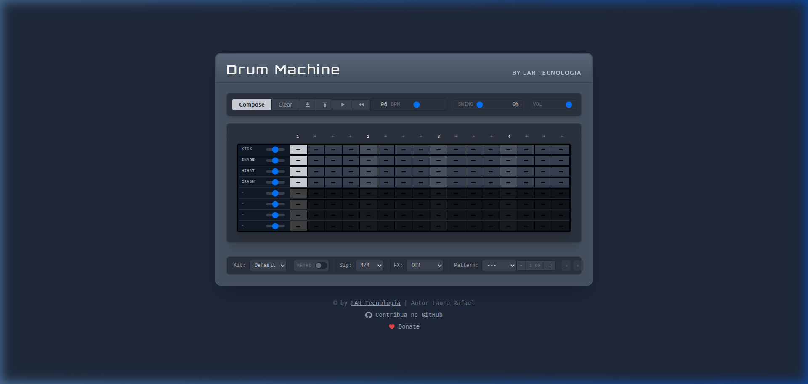

<](https://angular.dev)
[](https://www.typescriptlang.org/)
[](https://tailwindcss.com/)
[](LICENSE)

<br />



<br />

**[▶ Live Demo](#)** · **[🐛 Report Bug](https://github.com/LauroRafael/drum-machine/issues)** · **[💡 Request Feature](https://github.com/LauroRafael/drum-machine/issues)**

</div>

---

## ✨ Features

| Feature | Description |
|---------|-------------|
| 🎛️ **16-Step Sequencer** | Intuitive clickable grid with real-time visual feedback |
| 📄 **Multi-Page Patterns** | Extend your patterns beyond 16 steps with multiple pages |
| 🥁 **Multiple Drum Kits** | Switch between Default, Rock, Funk, and Techno kits |
| 🎵 **Preset Patterns** | One-click loading of Rock, Reggae, Pop, and Groove patterns |
| 🔊 **Reverb FX Engine** | Studio, Chamber, Gated, Plate, Hall & Church reverbs (FDN-based) |
| ⏱️ **Time Signatures** | Supports 4/4, 3/4, and 12/8 |
| 🎚️ **Per-Channel Volume** | Individual volume sliders for each drum channel |
| 🔇 **Mute / Solo** | Mute or solo any channel for precise mixing |
| 🎶 **Swing Control** | Adjustable swing from 0% to 100% for groove feel |
| 📥 **Import / Export** | Save and load patterns as JSON files |
| 🔔 **Metronome** | Built-in metronome with toggle switch |
| 🎨 **Retro Dark UI** | Sleek dark theme with Orbitron typography |

---

## 🚀 Getting Started

### Prerequisites

- **Node.js** 18+ and **npm** 9+
- **Angular CLI** 17+ (optional, for `ng` commands)

### Installation

```bash
# Clone the repository
git clone https://github.com/LauroRafael/drum-machine.git
cd drum-machine

# Install dependencies
npm install

# Start the development server
npm start
```

Navigate to **http://localhost:4200** — the app will automatically reload on file changes.

### Adding Drum Samples

Place your audio files (`.mp3` or `.wav`) in the following structure:

```
src/assets/samples/
├── default/          # Default kit
│   ├── kick.mp3
│   ├── snare.mp3
│   ├── hihat.mp3
│   ├── crash.mp3
│   ├── ride.mp3
│   ├── tom1.mp3
│   ├── tom2.mp3
│   └── tom3.mp3
├── rock/             # Rock kit
├── funk/             # Funk kit
├── techno/           # Techno kit
└── metro.wav         # Metronome click
```

---

## 🎵 Preset Patterns

Ready-to-use drum patterns stored in `src/assets/patterns/`:

| Pattern | BPM | Swing | Style |
|---------|-----|-------|-------|
| **Rock** | 120 | 0% | Classic kick/snare backbeat with 8th-note hi-hats |
| **Reggae** | 80 | 15% | One-drop feel with off-beat hi-hats and ride skank |
| **Pop** | 110 | 0% | Syncopated kick, snare on 2 & 4, 16th-note hi-hats |
| **Groove** | 100 | 30% | Funky syncopated pattern with swung hi-hats |

You can easily create your own presets — just compose a pattern in the app, export it as JSON, and drop it in the `assets/patterns/` folder!

---

## 🛠️ Tech Stack

- **Framework:** Angular 17 (Standalone Components, Signals)
- **Audio Engine:** Web Audio API with precise lookahead scheduling
- **Reverb:** Feedback Delay Network (FDN) — no impulse response files needed
- **Styling:** Tailwind CSS 3.4 with custom design tokens
- **Typography:** [Orbitron](https://fonts.google.com/specimen/Orbitron) (Google Fonts)
- **Notifications:** ngx-toastr

---

## 📁 Project Structure

```
src/
├── app/
│   ├── components/
│   │   ├── step-grid/                # Sequencer grid UI
│   │   └── transport-controls/       # Play, BPM, Swing, Import/Export
│   ├── core/
│   │   └── services/
│   │       ├── audio.service.ts      # Web Audio API engine
│   │       └── sequencer.service.ts  # Sequencer state & scheduling
│   ├── app.component.ts             # Root component
│   └── app.config.ts                # App providers
├── assets/
│   ├── patterns/                    # Preset pattern JSON files
│   └── samples/                     # Drum kit audio files
└── styles.css                       # Global styles
```

---

## 🏗️ Build

```bash
# Production build
npm run build

# The output will be in the dist/ directory
```

---

## 🤝 Contributing

Contributions are welcome! Feel free to open an issue or submit a pull request.

1. Fork the project
2. Create your feature branch (`git checkout -b feature/amazing-feature`)
3. Commit your changes (`git commit -m 'Add some amazing feature'`)
4. Push to the branch (`git push origin feature/amazing-feature`)
5. Open a Pull Request

---

## 💖 Support the Project

If you enjoy this project and want to support its development, consider buying me a coffee!

<div align="center">

[](https://ko-fi.com/laurorafael)

<a href="https://ko-fi.com/laurorafael">
  
</a>

</div>

---

## 📄 License

This project is open source and available under the [MIT License](LICENSE).

---

<div align="center">

Made with ❤️ by [Lauro Rafael](https://lartecnologia.com.br) — **LAR Tecnologia**

[](https://github.com/LauroRafael)

</div>
]]>
